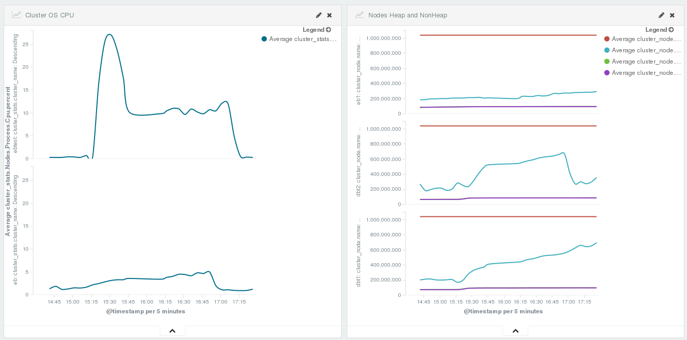

# Kibana dashboards

Folder **kibana** contains sample Kibana objects for quick start.

## Installation

Installation is the same as for all [dashboards](https://github.com/elastic/beats-dashboards) from official beats. Download [script](https://github.com/elastic/beats-dashboards/blob/master/load.sh) and place to folder **kibana**. To load the dashboards, execute the [script](https://github.com/elastic/beats-dashboards/blob/master/load.sh) pointing to the Elasticsearch HTTP URL:

```bash
cd ~/workspace/go/src/github.com/radoondas/elasticbeat/kibana
# get the content of the file [import_dashboards.sh](https://github.com/elastic/beats/blob/master/dev-tools/import_dashboards.sh) and save on the disk
chmod u+x load.sh
./load.sh -url http://localhost:9200
```

If you want to use HTTP authentication for Elasticsearch, you can specify the credentials as a second parameter:

```bash
./load.sh -url http://localhost:9200 -user 'admin:password'
```

For more options:

```bash
./load.sh -h
```

## Examples



