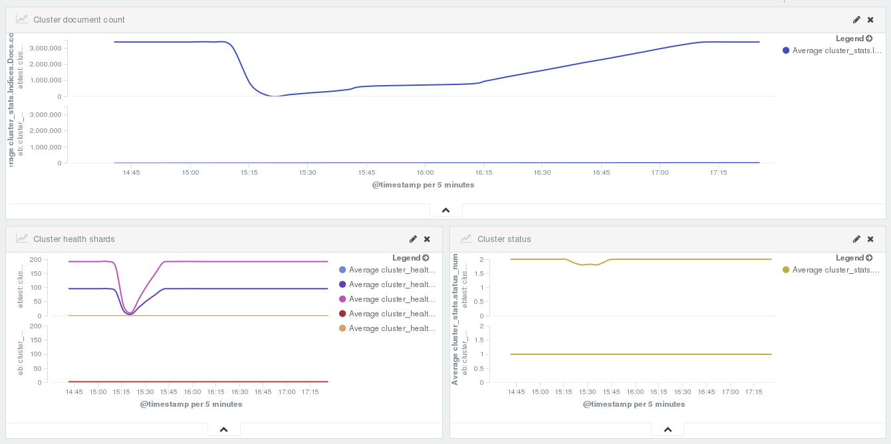

# ElasticBeat
Use your elasticsearch to store your cluster's statistics easy with only elastic components!! :)

Current status: **development release**. Further development and fine-tuning is in progress.

**If you have any ideas or issues, please contribute.**

## Description
Simple [beat](https://github.com/elastic/beats) for ElasticSearch cluster (and/or nodes) statistics. This beat requests statistics from your elastisearch cluster via available API.
Following API is currently supported:
 * /_cluster/health
 * /_cluster/stats
 * /_nodes/stats/process,jvm,os,fs,thread_pool,transport,http,breaker,script

You can decide which statistics to store. Configure your options in **elasticbeat.yml** config file:
```
stats:
  cluster: true
  nodes: true
  health: true
```

## Upload ElasticBeat template:

```bash
curl -XPUT 'http://localhost:9200/_template/elasticbeat' -d@elasticbeat.template.json
```

## Important Note
In order to have **consistent** Node statistics, you need to set unique node names for each node of your elasticsearch cluster.

In configuration file elasticsearch.yml:
```
node.name: testnode1
```

## Examples



